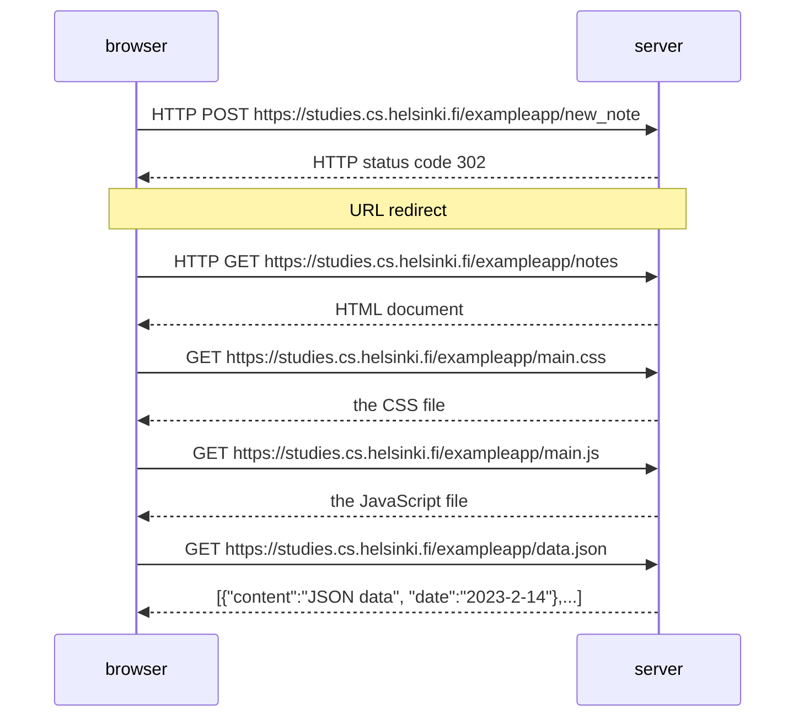

# Exercises 0.1.-0.6.

## 0.1: HTML
Review the basics of HTML.

## 0.2: CSS
Review the basics of CSS.

## 0.3: HTML forms
Learn about the basics of HTML forms.

## 0.4: New note diagram

```mermaid
sequenceDiagram
    participant browser
    participant server
    browser->>server: HTTP POST https://studies.cs.helsinki.fi/exampleapp/new_note
    server-->>browser: HTTP status code 302
    Note over browser, server: URL redirect 
    browser->>server: HTTP GET https://studies.cs.helsinki.fi/exampleapp/notes
    server-->>browser: HTML document
    browser->>server: GET https://studies.cs.helsinki.fi/exampleapp/main.css
    server-->>browser: the CSS file
    browser->>server: GET https://studies.cs.helsinki.fi/exampleapp/main.js
    server-->>browser: the JavaScript file
    browser->>server: GET https://studies.cs.helsinki.fi/exampleapp/data.json
    server-->>browser: [{"content":"JSON data", "date":"2023-2-14"},...]
```
